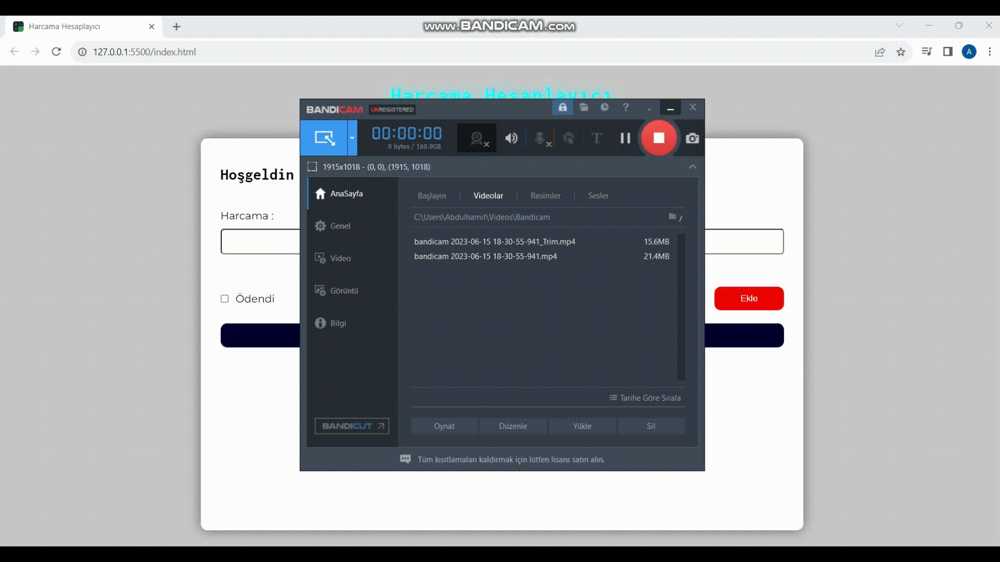

# Technologies used in the project

- HTML
- CSS
- JavaScript

# what is the purpose of the project
- to create an account of expenditures and to keep it recorded

# Yapılacaklar
- Ekle butonuna tıklanıldığında inputların içerisine yazılanlara eriş ve alert ile akrana yaz

- İnputlardan biri dahi boş ise ekrana uyarı olarak alert bas
- İki input'da dolu ise ekrana bir tane harcama kartı bas
- Eğer chebox tiklenirse payed class'ı ekle
- Form gönderilİnce inputları temizle
- Bir toplam alanı ve js de toplam değişkeni oluştur

- Js tarafından eklenen bütün harcamaların fiyatlarını bu değişkene ekle
- Değişken her güncellendiğinde ekranı da güncelle (fonk. yazılabilir)
- Silme butonuna basılma olayını izle

- butona tıklandığında kapsyayıcısın html'den kaldır
- kaldırılan harcamanın fiyatını toplamdan çıkart
kullanıcı ismini al.

- ve ismi localstroage a kaydet
- kullanıcı uygulamaya girdiğinde localstroage'a ismi kaydedilmişse onu al ve inputa aktar
- filtrleeme alanında ne seçilirse onun değerini al

- o değere göre hangi haracamların ekrana karar ver

# Notlar

- Hoisting

- - Önemli olan değerleri (fonksyion ve değişkenler) ilk önce tanımlar

- Bu sayda fonksiyonları önce kullanıp sonra tanımlayabiliyoruz

- !

- - Değişkenin değerlerinin undfined null NaN {} "" bütün boş olma durumlarını o kontrol

- - return

- fonksyionu durudurmaya yarar
- fonksiyonun çağrılıdğı yere veri gönderme
break

- switch case yapısında caselerden sonra ve döngülerde kullanılır
- == yalnızca değer kontrolu yaprken ( 3 == "3" > true)

- === hem tür hem değer kontrolü yapar (3 === "3" > false)

- !! jS tarafında eklenen bir html elemanını seçici methodları ile tekrar js'ye çağıramıyoruz

